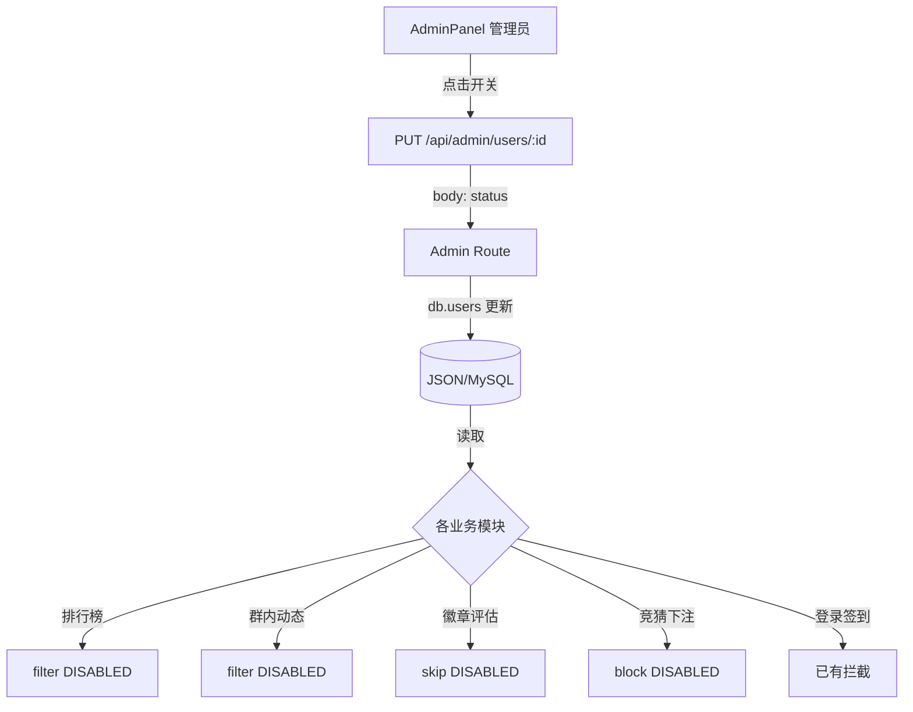

## 用户需求

为管理员后台添加账号禁用/启用功能。管理员在后台用户列表中一键切换账号状态，被禁用的账号从所有公开场景中移除，但保留账号数据不删除。

## 核心功能

- **后台开关**：管理员在用户列表中看到每个用户的当前状态，点击即可切换 CLAIMED ↔ DISABLED
- **排行榜屏蔽**：禁用用户不出现在总积分/今日/胜率/连胜/盈利五个榜单中
- **群内动态屏蔽**：禁用用户的竞猜、签到、徽章等动态从群内动态流中隐藏
- **徽章评估跳过**：evaluateAllBadges 不再评估禁用用户
- **竞猜禁止**：禁用用户尝试下注时返回错误提示
- **登录/签到/答题**：已有拦截（DISABLED 用户 getAuthenticatedUser 返回 null），无需额外改动

## 技术栈

- 后端：Express + TypeScript（Prisma + db_service JSON 双模）
- 前端：React + TypeScript + Tailwind CSS
- 状态字段：User.status（已有，无需 schema 变更）

## 实施策略

### 后端改动（4个文件）

所有改动均为一两行的过滤条件或检查，无需新端点，复用现有 `PUT /api/admin/users/:id` 的 body.status 能力。

1. **排行榜过滤** (matches.ts:439)：`db.users.filter()` 追加 `&& item.status !== 'DISABLED'`
2. **动态过滤** (activity_service.ts:136)：`activities.filter()` 前引入用户禁用集合一次性查重
3. **徽章跳过** (badge_service.ts:372)：`for (const user of db.users)` 循环内 `if (user.status === 'DISABLED') continue`
4. **竞猜拒绝** (prediction_service.ts:39)：`placePrediction` 函数开头加禁用检查，抛 `Error('账号已被禁用')`

### 前端改动（1个文件）

5. **AdminPanel.tsx 用户列表**：每行加一个切换开关组件，调用现有 `PUT /api/admin/users/:id` 传入 `{ status: 'DISABLED' }` 或 `{ status: 'CLAIMED' }`，视觉上用红色/绿色区分禁用/正常状态。

### 性能影响

- 排行榜：一次 filter 增加 O(1) 字符串比较，无性能影响
- 动态流：预构建禁用用户 Set，过滤 O(n)，可忽略
- 徽章评估：循环内 O(1) 跳过，无额外查询

## 架构设计



## 改动文件清单

```
src/
├── server/
│   ├── routes/
│   │   └── matches.ts          # [MODIFY] 排行榜 users 过滤加 DISABLED
│   ├── services/
│   │   └── prediction_service.ts # [MODIFY] placePrediction 加禁用检查
│   ├── activity_service.ts     # [MODIFY] getRecentActivities 过滤禁用用户
│   └── badge_service.ts        # [MODIFY] evaluateAllBadges 跳过 DISABLED
└── components/
    └── AdminPanel.tsx           # [MODIFY] 用户列表加状态切换开关
```